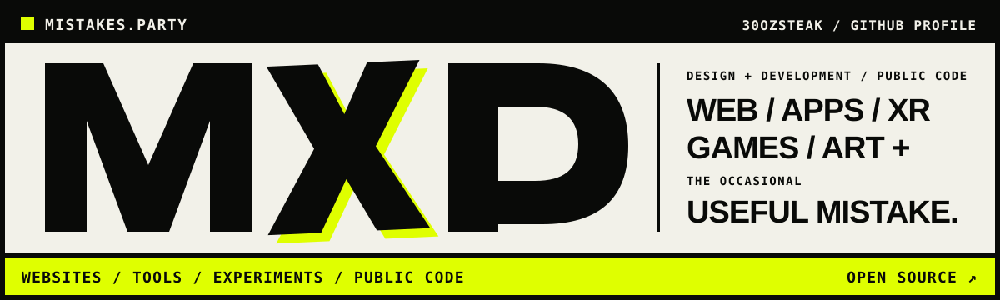

  

# NICK / 30OZSTEAK

**WEB / APPS / XR / GAMES / ART + THE OCCASIONAL USEFUL MISTAKE.**

Denver-based developer making sharp interfaces, small tools, public experiments, and enough room to get something wrong on the way to getting it right.

## SELECTED WORK

|   | PROJECT | SIGNAL |
|--:|:--------|:-------|
| **01** | **[MISTAKES.PARTY ↗](https://www.mistakes.party)** A loud, text-first home for work, code, dispatches, and tiny live signals from whoever is here. [SOURCE](https://github.com/30ozSteak/mistakes.party) | `WEB / INDEX` `NEXT / TYPESCRIPT / CLOUDFLARE` `2026 / ONGOING` |
| **02** | **[ITADW ↗](https://github.com/30ozSteak/ITADW)** A browser extension built to push back on unsolicited DMs. | `CHROME EXTENSION` `JAVASCRIPT` `2020 / ARCHIVE` |
| **03** | **[LIGHTHOUSE CHECKER ↗](https://github.com/30ozSteak/lighthouse-checker)** Performance-audit snapshots and a small Lighthouse working set, preserved in public. | `WEB PERFORMANCE` `LIGHTHOUSE / JAVASCRIPT` `2021 / ARCHIVE` |

## WORKING PRINCIPLES

`01 / SMALL TEAMS` — Close collaboration and short feedback loops.  
`02 / SHARP INTERFACES` — Clear hierarchy; nothing ornamental that cannot earn its space.  
`03 / PUBLIC CODE` — Ship the source when the source is part of the story.  
`04 / USEFUL MISTAKES` — Make room to try, learn, and leave the evidence intact.

## ELSEWHERE

**[MISTAKES.PARTY ↗](https://www.mistakes.party)** / **[EMAIL ↗](mailto:hello@mistakes.party)** / **[X ↗](https://x.com/iaaafm)** / **[MEDIUM ↗](https://medium.com/@30ozsteak)** / **[GISTS ↗](https://gist.github.com/30ozSteak)**

  MISTAKES.PARTY / DENVER, COLORADO / KEEP THE EVIDENCE

